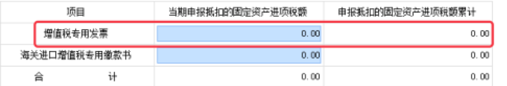

# 自动报税对接文档(非单点登录方式)

## 1 概述

### 1.1 文档目的
本文档是为了方便第三方合作伙伴软件与畅捷通系统进行自动报税对接时的说明，并对相关各方（用户、畅捷通系统、第三方软件）的操作进行定义。

### 1.2 相关技术
* 1、数据交互采用 json 格式数据。
* 2、采用https 方式对接数据。
* 3、数据传输的安全性

	> 双方传输的数据使用RSA非对称的方式进行签名验证，第三方软件请求时，需要根据畅捷通提供的公钥进行RSA加密，详情请参考附件中的java程序demo。

### 1.3 支持的报表
* **1、财务报表**

	> 支持以下财务报表，输出完整金三标准格式xml：
	
	> 1)小企业会计准则财务报表：资产负债表、利润表、现金流量表
	
	> 2)企业会计准则财务报表：资产负债表、利润表
* **2、增值税报表**
	
	> 目前支持以下季报、月报、年报数据输出：
	
	> 1)《固定资产（不含不动产）进项税额抵扣情况表》第一行第1列"增值税专用发票"数据。
	
	
	> 2)《增值税纳税申报表附列资料（二）》第15行数据
	
	
	> 3)《增值税纳税申报表附列资料（四）》第1行数据
	
* **3、所得税报表**
	>  支持所得税报表以下三项（月报/季报）数据的输出：
	
	> 1)营业收入＝利润表的"营业收入"项目
	
	> 2)营业成本＝利润表的"营业成本"项目
	
	> 3)利润总额＝利润表的"利润总额"项目

## 2 系统交互流程

说明：

* 1、MCP中，每个税号下面数据的报税状态有3种：未填写、已填写、已申报。第三方伙伴软件本地数据最好也有这3种状态，如果两边的状态不一致时，注意调用 MCP状态变更接口和MCP端同步。第三方伙伴软件自动填写报税数据时，需要根据这几种状态来决定要不要改写本地数据。

* 2、	流程图中查询未填写的客户报表，图中给出了两个不同的流程，具体用哪种方式开发由第三方伙伴来决定

	> 1）	在第三方伙伴软件中放一个"自动填写"的按钮，客户点击这个按钮时，才从MCP查询未填写的客户报表
	
	> 2）	在第三方伙伴软件中放一个"自动填写"的按钮，客户点击这个按钮时，才从MCP查询未填写的客户报表
	
	
## 3 用户相关的操作
### 3.1 新用户开通自动报税
新用户第一次使用自动报税前，得要在好会计开通自动报税，填写企业税号、联系人等信息。
### 3.2 老用户国税一键申报
老用户开通了一键报税后，如果财务数据没问题，即可以进行一键报税。操作步骤如下：
> 1、打开好会计并登录。

> 2、进入 "税务\国税申报" 界面
	

> 3、点 "一键报税"按钮
	
	
### 3.3 自动填写
如果第三方伙伴软件不是全自动的自动报税，则需要在第三方伙伴软件界面上有一个"自动填写"的按钮，由用户点击这个按钮来手动触发第三方伙伴软件的自动填写。
	

### 3.4 强制重新填写
如果第三方伙伴软件自动填写以后，用户又手动修改了第三方伙伴软件内的报税数据，如果这时用户想不要这些数据了，想恢复成自动填写的数据（即MCP服务端的数据），这个时候用户可以点第三方伙伴软件提供的"强制重新填写"按钮来实现上述功能。

## 4 MCP提供给第三方伙伴软件的接口

### 4.1 数字签名

### 4.1 数字签名

* 第三方软件调用好会计接口时，所有的请求必须使用数字签名。
* 数字签名的生成方式：使用RSA加密，用公钥对税号（或税号串）进行加密，得到的结果转换为字符串，即数字签名（可参考示例）。
* 数字签名的使用方法：将数字签名赋值给http请求header中的Authorization字段即可（可参考示例）。
